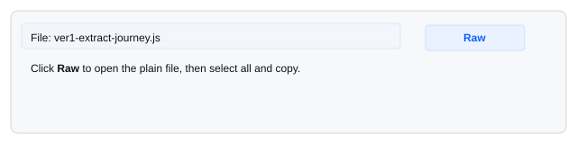
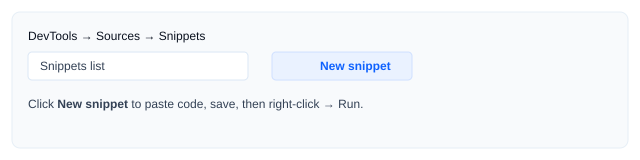

# SFMC Journey Extractor — Quick Reference

A single‑page, non‑technical README that explains how to run the four DevTools snippets (ver1 / ver2 / ver2-sms / ver3) to extract SFMC Journey / Email / SMS analytics text and paste it into Google Sheets.

## Purpose
Run a small JavaScript snippet inside Chrome DevTools to copy analytics text to your clipboard and paste it directly into Google Sheets. No installs required — just Chrome and the page open.

## The four scripts (what they do)
- **ver1 — Extract Journey Analytics**
  - Targets the Email Delivery & Engagement style card (delivery, opens, clicks, unsubscribes).
  - Copies a two‑row TSV: first row = header (metric names), second row = values. Paste into Google Sheets A1.
  - File: `ver1-extract-journey.js` — Quick copy: open the file link and click **Raw** → select all → copy.

- **ver2 — Extract Email Analytics**
  - Extracts the Email Analytics block metadata: block title, available contexts, and analytics iframe URL (if present).
  - Copies a small key/value TSV (one pair per line) to clipboard.
  - File: `ver2-extract-email.js` — Quick copy: open the file link and use the GitHub copy icon or Raw view.

- **ver2-sms — Extract SMS/MMS Analytics**
  - Tailored for the SMS/MMS card layout. Copies KPI header + values and any internal table rows.
  - Output: KPI rows (two rows), blank separator, then table header + rows (if present). Paste into Google Sheets A1.
  - File: `ver2-sms-extract-sms.js` — Quick copy: open the file link and press **Raw** → select all → copy.

- **ver3 — Extract Activity Names**
  - Collects journey activity names (elements with `.canvas-name.slds-line-clamp`) and copies a newline list (one name per line).
  - Paste into Google Sheets A1 to get one activity per row.
  - File: `ver3-extract-activity-names.js` — Quick copy: use the GitHub code view copy icon or keyboard select+copy.

---

## How to view and copy a script from this GitHub repo
If you need to copy a script from GitHub to paste into DevTools, follow these steps:

1. Open the script page on GitHub (example):
   - ver1: https://github.com/kenxavierr/sfmc-journey-extractor/blob/main/ver1-extract-journey.js
   - ver2: https://github.com/kenxavierr/sfmc-journey-extractor/blob/main/ver2-extract-email.js
   - ver2-sms: https://github.com/kenxavierr/sfmc-journey-extractor/blob/main/ver2-sms-extract-sms.js
   - ver3: https://github.com/kenxavierr/sfmc-journey-extractor/blob/main/ver3-extract-activity-names.js

2. On the file page you can copy the code in one of these ways:
   - Click the **Raw** button (near the top-right). When the raw file opens, press `Ctrl/Cmd+A` then `Ctrl/Cmd+C` to copy all text.
   - Or, on the file view, click the triple-dot menu ("…") or the small clipboard icon (if visible) and choose **Copy**.
   - If you prefer keyboard only: click within the code area, press `Ctrl/Cmd+A` then `Ctrl/Cmd+C`.

3. In Chrome DevTools: create a new Snippet (Sources → Snippets → New snippet), click inside the editor, and paste (`Ctrl/Cmd+V`). Save and run the snippet.

Notes
- If GitHub’s UI changes, the Raw button is a reliable fallback: open Raw → select all → copy.
- If you have a slow network, prefer opening the Raw view — it loads the bare file faster.

## Quick steps — run & paste (1 minute)
1. Open the SFMC page showing the analytics card or journey canvas in Chrome and wait until it’s visible.  
2. Press **F12** to open DevTools → **Sources → Snippets → New snippet**.  
3. Paste the copied script, save, then run.  
4. An alert confirms the data was copied. Open Google Sheets, click A1, paste (Ctrl/Cmd+V).

> Tip: You can also paste the script directly into the Console and press Enter to run immediately (no snippet save needed).

## If the content is inside an iframe
- Option A (recommended): In DevTools Console, use the context selector (top-left) to choose the iframe, then run the snippet there.
- Option B: Inspect the iframe, copy its `src`, open that URL in a new tab, and run the snippet in that tab.

## Quick visual guide

Where to click on GitHub to copy the raw file (example):

Where to create/run a Snippet in Chrome DevTools:

## What the scripts copy (how to paste)
- **ver1**: Two-row TSV — paste into Sheets A1; columns align automatically.
- **ver2**: Key/value TSV — paste into Sheets or a text editor.
- **ver2-sms**: KPI header & value rows, blank line, then table header + rows — paste into A1.
- **ver3**: Newline-separated list — paste into column A (one item per row).

## Troubleshooting (simple)
- **No analytics card found**: Wait 1–3 seconds and re-run (dashboard may still render); check iframe.  
- **Clipboard copy failed**: The script logs the output to DevTools **Console** — open Console (F12 → Console), copy the logged text manually, and paste into Sheets.  
- **Everything pasted into one column**: In Google Sheets: **Data → Split text to columns → Separator: Tab**.

## Files in this repo
- Snippets (ready to copy):
  - `ver1-extract-journey.js`
  - `ver2-extract-email.js`
  - `ver2-sms-extract-sms.js`
  - `ver3-extract-activity-names.js`

- Visual aids / demos (optional previews):
  - `ver1-mock.html`, `ver2-mock.html`, `ver2-sms-mock.html`, `ver3-mock.html` — simple mockups showing the layouts and sample clipboard output.
  - `demo.html` and `demo-anim.svg` — a small interactive/animated demo of the workflow.
  - `cheatsheet.html` — printable one‑page cheat sheet.

## Permissions & privacy
- The snippets only read text from the page you run them on and copy it to your clipboard. They do not send data to external servers.
- Do not run these scripts on pages you are not authorized to extract data from.

---

If you’d like I can also add tiny one‑line copy hints next to each snippet link in the repo home page or create PNG screenshots instead of SVGs. Tell me if you prefer that.